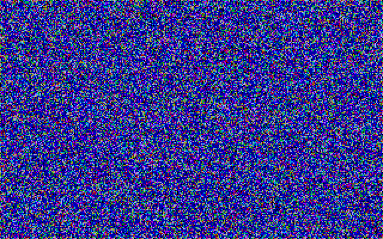

# GGI
Grue's Graphic Interface Library

A graphic interface library based loosely on the Borland Graphic Interface library (BGI)
that will run on open source or hobby OSs.

The goal is to provide API compatibility with BGI without the requirement of separate
driver files.  Compatibility would be through a standard series of variables and/or pointers.

Reference Material:

	http://www.bitsavers.org/pdf/borland/borland_C++/Borland_C++_Version_5_Programmers_Guide_1997.pdf
	http://www.bitsavers.org/pdf/ibm/pc/cards/IBM_VGA_XGA_Technical_Reference_Manual_May92.pdf
	http://www.bitsavers.org/pdf/borland/borland_C++/Borland_C++_Version_4.0_DOS_Reference_Oct93.pdf
	BGI.DOC from "The BGI Driver Toolkit"
	Borland PowerPack for DOS User's Guide
	VESA BIOS EXTENSION (VBE) Core Functions Standard Version 3.0

Functions Implemented:

	int graphresult(void);
	char * grapherrormsg(int errorcode);
	void getarccoords(struct arccoordstype *arccoords);
	void getaspectratio(int *xasp, int *yasp);
	int getbkcolor(void);
	int getcolor(void);
	void setbkcolor(int color);
	void setcolor(int color);
	void initgraph(int *graphdriver, int *graphmode, char *pathtodriver);
	void detectgraph(int *graphdriver, int *graphmode);
	int getgraphmode(void);
	char * getdrivername(void);
	int getgraphmode(void);
	int getmaxcolor(void);
	int getmaxmode(void);
	int getmaxx(void);
	int getmaxy(void);
	char * getmodename(int mode_number);
	void getmoderange(int graphdriver, int *lomode, int *himode);
	void getpalette(struct palettetype *palette);
	int getpalettesize(void);
	void closegraph(void);
	void putpixel(int x, int y, int color);
